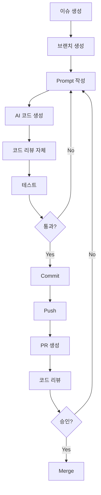

# 🎯 단풍바람 프로젝트 개발 컨벤션

> AI 기반 개발(Vibe Coding)을 위한 실전 가이드

---

## 📚 목차

1. [핵심 원칙](#1-핵심-원칙)
2. [작업 흐름 (Workflow)](#2-작업-흐름-workflow)
3. [Prompt 작성법](#3-prompt-작성법)
4. [Git & PR 규칙](#4-git--pr-규칙)
5. [코드 스타일](#5-코드-스타일)
6. [추가 제안 사항](#6-추가-제안-사항)

---

## 1. 핵심 원칙

### ✅ DO (이렇게 하세요)

#### 1-1. Prompt 단위 작업
```
✅ 하나의 Prompt = 하나의 작업 = 하나의 Commit = 하나의 테스트
```

**예시:**
```
Prompt 1: "캐릭터 검색 기능 추가"
  → 개발 → 테스트 → Commit

Prompt 2: "검색 결과에 하이라이트 추가"
  → 개발 → 테스트 → Commit
```

**왜 이렇게 하나요?**
- 작업 단위가 명확해집니다
- 문제 발생 시 쉽게 롤백할 수 있습니다
- 코드 리뷰가 쉬워집니다
- 히스토리가 깔끔해집니다

#### 1-2. PR 기반 협업
```
✅ 모든 변경사항 = PR을 통해 = 리뷰 후 Merge
```

**작업 흐름:**
```
1. 이슈 생성
2. 브랜치 생성
3. Prompt 기반 개발
4. 커밋
5. PR 생성
6. 코드 리뷰
7. Merge
```

**왜 이렇게 하나요?**
- 코드 품질을 유지할 수 있습니다
- 팀원들이 변경사항을 알 수 있습니다
- 지식이 공유됩니다
- 실수를 미리 방지할 수 있습니다

### ❌ DON'T (이렇게 하지 마세요)

```
❌ main 브랜치에 직접 push
❌ 여러 기능을 한 Prompt에 요청
❌ 테스트 없이 커밋
❌ 모호한 커밋 메시지
❌ PR 없이 코드 변경
```

---

## 2. 작업 흐름 (Workflow)

### 🔄 완전한 개발 사이클



### 📋 단계별 상세 가이드

#### Step 1: 이슈 생성
```bash
GitHub Issues → New Issue → 템플릿 선택
- Feature Request
- Bug Report
- Documentation
```

**좋은 이슈 예시:**
```markdown
Title: [Feature] 캐릭터 검색 기능 추가

Description:
메인 페이지에서 캐릭터를 이름/닉네임으로 검색할 수 있어야 합니다.

요구사항:
- 실시간 필터링
- 대소문자 구분 없음
- 검색어 하이라이트
- 결과 없을 시 안내 메시지

완료 조건:
- [ ] 검색창 UI 구현
- [ ] 필터링 로직 구현
- [ ] 모바일 반응형 확인
```

#### Step 2: 브랜치 생성
```bash
# 이슈 번호 13번이라고 가정
git checkout -b feature/13-character-search
```

**브랜치 네이밍 규칙:**
```
<type>/<issue-number>-<description>

Types:
- feature/   : 새 기능
- fix/       : 버그 수정
- refactor/  : 리팩토링
- docs/      : 문서 작업
- style/     : 스타일 변경
- test/      : 테스트 추가
- chore/     : 설정 등 기타
```

#### Step 3: Prompt 작성 & 개발

**Cursor에서:**
```
Ctrl+L (또는 Cmd+L) → AI 채팅 열기

Prompt:
"캐릭터 검색 컴포넌트를 만들어줘:

위치: src/lib/components/CharacterSearch.svelte

기능:
- input 박스 (placeholder: '캐릭터 검색...')
- 입력 시 실시간 필터링
- characters 배열에서 name, nickname 검색
- 대소문자 구분 없음
- 검색 결과를 CharacterCard로 표시
- 결과 없으면 '검색 결과가 없습니다' 메시지

스타일:
- Tailwind CSS 사용
- 모바일 반응형
- 검색 아이콘 포함 (lucide-svelte의 Search)"
```

#### Step 4: 코드 확인 & 테스트
```bash
# 개발 서버 실행
npm run dev

# 타입 에러 확인
npm run check
```

**🌐 AI에게 브라우저 테스트 요청 (추천!)**
```
Cursor에서 Ctrl+L:

"방금 만든 기능을 브라우저로 테스트해줘:
- localhost:5173 접속
- [기능] 동작 확인
- 모바일 크기(375px)에서도 확인
- 콘솔 에러 없는지 확인
- 스크린샷도 찍어줘"
```

**📖 상세 가이드:** [BROWSER_TESTING.md](./BROWSER_TESTING.md)

**수동 테스트 (필요시)**
```bash
# 브라우저에서 수동 확인
# - 기능 동작 확인
# - F12 → 반응형 모드로 모바일 확인
```

#### Step 5: Commit
```bash
git add .
git commit -m "Add: Character search component with real-time filtering"
```

**Commit Message 규칙:**
```
<Type>: <Subject>

<Body (선택)>

<Footer (선택)>
```

**Type 종류:**
- `Add`: 새 기능
- `Update`: 기존 기능 개선
- `Fix`: 버그 수정
- `Refactor`: 리팩토링
- `Style`: 포맷팅
- `Docs`: 문서
- `Test`: 테스트
- `Chore`: 기타

**예시:**
```
Add: Character search component

- Real-time filtering by name and nickname
- Case-insensitive search
- Mobile responsive design
- Empty state message

Related to #13
```

#### Step 6: Push & PR 생성
```bash
# Push
git push origin feature/13-character-search

# PR 생성
GitHub → Pull Requests → New Pull Request
→ PR 템플릿이 자동으로 나타남
→ 내용 작성 후 Create
```

#### Step 7: 코드 리뷰 & Merge
```
1. 팀원에게 리뷰 요청
2. 피드백 받으면 수정 후 다시 push
3. 승인받으면 Merge
4. 브랜치 삭제
```

---

## 3. Prompt 작성법

### 🎯 좋은 Prompt의 5가지 요소

1. **명확한 목표** - 무엇을 만들까?
2. **구체적인 요구사항** - 어떤 기능이 필요한가?
3. **위치 명시** - 어디에 만들까?
4. **스타일 가이드** - 어떻게 보일까?
5. **제약사항** - 뭘 사용/사용하지 말까?

### ✅ 좋은 Prompt 예시

```
"멤버 상세 페이지에 정렬 기능을 추가해줘:

위치: src/routes/member/[id]/+page.svelte

기능:
- 드롭다운 메뉴 (획득 날짜순, 최신순)
- 선택하면 settlementItems 배열 재정렬
- 선택 상태를 localStorage에 저장
- 페이지 로드 시 이전 선택값 복원

UI:
- 헤더 하단에 배치
- Tailwind CSS 사용
- 모바일 친화적인 크기
- 아이콘: lucide-svelte의 ArrowUpDown

제약사항:
- 기존 레이아웃을 깨지 않게
- TypeScript 타입 안전성 유지"
```

### ❌ 나쁜 Prompt 예시

```
❌ "정렬 만들어줘"
   → 너무 모호함. 무엇을 정렬? 어디에?

❌ "검색이랑 정렬이랑 필터링이랑 페이지네이션 다 만들어줘"
   → 한 번에 너무 많음. Prompt는 작게 쪼개기

❌ "있잖아, 그거 있잖아... 그거 만들어줘"
   → 구체적이지 않음

❌ "예쁘게 만들어줘"
   → 주관적. 구체적인 스타일 가이드 필요
```

### 🎓 Prompt 체크리스트

작성 전에 확인하세요:

- [ ] 무엇을 만들지 한 문장으로 설명할 수 있는가?
- [ ] 파일 경로를 명시했는가?
- [ ] 필요한 기능을 나열했는가?
- [ ] UI/스타일 요구사항을 적었는가?
- [ ] 사용할 라이브러리/도구를 언급했는가?
- [ ] 하나의 작업 단위인가? (너무 크지 않은가?)

### 🔄 Prompt 개선 프로세스

```
1차 Prompt: "검색 기능 만들어줘"
   ↓
AI 응답: "어떤 검색인가요? 어디에 만들까요?"
   ↓
2차 Prompt: "메인 페이지에 캐릭터 검색 기능을 추가해줘"
   ↓
AI 응답: 기본 검색창 생성
   ↓
3차 Prompt: "실시간 필터링과 하이라이트 기능 추가해줘"
   ↓
완성! ✅
```

---

## 4. Git & PR 규칙

### 🌿 브랜치 전략

```
main (보호됨)
  ├── feature/13-character-search
  ├── fix/42-image-upload-bug
  ├── refactor/99-api-layer
  └── docs/25-api-documentation
```

**규칙:**
- `main`: 항상 배포 가능한 상태
- `feature/*`: 새 기능 개발
- `fix/*`: 버그 수정
- `refactor/*`: 리팩토링
- `docs/*`: 문서 작업

### 📝 Commit Message Convention

```
<Type>: <Subject>

[Body - 선택사항]

[Footer - 선택사항]
```

**Subject 규칙:**
- 50자 이내
- 명령형 (Add, not Added)
- 마침표 없음
- 첫 글자 대문자

**Body 규칙:**
- 72자마다 줄바꿈
- 무엇을, 왜 했는지 설명
- 어떻게는 코드를 보면 알 수 있음

**Footer:**
- `Closes #13` - 이슈 닫기
- `Related to #42` - 관련 이슈
- `Breaking Change:` - 호환성 파괴

**예시:**
```
Add: Character search with real-time filtering

Implements search functionality on the main page that filters
characters by name and nickname. The search is case-insensitive
and provides instant feedback as the user types.

- Add CharacterSearch component
- Integrate with existing CharacterCard
- Add empty state message

Closes #13
```

### 🔀 PR 규칙

#### PR 제목
```
[Type] Description (#issue)

예시:
[Feature] Add character search functionality (#13)
[Fix] Resolve image save bug on mobile (#42)
[Docs] Update API documentation (#25)
```

#### PR 크기
```
✅ Small: 1-3 파일, < 200 라인
✅ Medium: 4-7 파일, < 500 라인
⚠️ Large: 8+ 파일, > 500 라인 (쪼갤 수 있다면 쪼개기)
```

#### PR Description (자동 템플릿)
```markdown
## 📋 작업 내용
캐릭터 검색 기능 추가

## 🎯 관련 이슈
Closes #13

## 🤖 사용한 Prompt
- "캐릭터 검색 컴포넌트 만들어줘..."
- "실시간 필터링 추가해줘..."
- "검색 결과 하이라이트 기능 추가해줘..."

## ✅ 체크리스트
- [x] 로컬에서 테스트 완료
- [x] 타입 에러 없음
- [x] Linter 통과
- [x] 모바일 반응형 확인

## 📸 스크린샷
(스크린샷 첨부)

## 💬 특이사항
검색 성능을 위해 debounce 적용 (300ms)
```

#### PR 리뷰 프로세스
```
1. PR 생성
2. 자동 체크 (CI/CD)
3. 리뷰어 배정
4. 코드 리뷰
   - 코멘트 남기기
   - 변경 요청
   - 승인
5. 피드백 반영
6. 최종 승인
7. Merge (Squash merge 권장)
8. 브랜치 삭제
```

---

## 5. 코드 스타일

### 📐 파일 & 폴더 네이밍

```
Components:     PascalCase        CharacterCard.svelte
Utilities:      camelCase         dataHelpers.ts
Constants:      UPPER_SNAKE       API_ENDPOINTS.ts
Types:          PascalCase        Character, SettlementItem
Routes:         kebab-case        member/[id]/save/
```

### 🎨 Svelte 컴포넌트 구조

```svelte
<script lang="ts">
  // 1. Imports
  import { someStore } from '$lib/stores';
  import type { Character } from '$lib/types';
  
  // 2. Props
  interface Props {
    character: Character;
    onClick?: () => void;
  }
  let { character, onClick }: Props = $props();
  
  // 3. State
  let isHovered = $state(false);
  
  // 4. Derived
  let displayName = $derived(`${character.name} (${character.nickname})`);
  
  // 5. Functions
  function handleClick() {
    onClick?.();
  }
</script>

<!-- 6. Template -->
<div class="character-card">
  {displayName}
</div>

<!-- 7. Styles (있다면) -->
<style>
  /* 최소화 - Tailwind 우선 사용 */
</style>
```

### 💅 Tailwind CSS 사용

```svelte
✅ 좋은 예:
<div class="flex items-center gap-4 p-4 rounded-lg bg-white shadow-md">

❌ 나쁜 예:
<div class="flex items-center gap-4 p-4 rounded-lg" style="background: white">

✅ 반응형:
<div class="grid grid-cols-1 md:grid-cols-2 lg:grid-cols-3">

✅ 다크모드 고려:
<div class="bg-white dark:bg-gray-800 text-black dark:text-white">
```

### 🔤 TypeScript 타입

```typescript
✅ 명시적 타입:
function getCharacter(id: string): Character | undefined {
  return characters.find(c => c.id === id);
}

❌ any 사용:
function getCharacter(id: any): any {  // ❌
  return characters.find(c => c.id === id);
}

✅ Interface vs Type:
interface Character {  // 확장 가능한 객체
  id: string;
  name: string;
}

type SearchFilter = 'name' | 'nickname';  // Union, Literal
```

---

## 6. 추가 제안 사항

### 🚀 성능 최적화

#### 6-1. 코드 분할 (Code Splitting)
```javascript
// ❌ 나쁜 예: 모든 아이콘 임포트
import * as Icons from 'lucide-svelte';

// ✅ 좋은 예: 필요한 것만
import { Search, User, Home } from 'lucide-svelte';
```

#### 6-2. 이미지 최적화
```svelte
<!-- ✅ 좋은 예 -->

```

#### 6-3. 리스트 최적화
```svelte
<!-- ✅ key 사용 -->
{#each characters as character (character.id)}
  <CharacterCard {character} />
{/each}
```

### 🔐 보안

#### 6-4. 환경 변수
```bash
# .env (절대 커밋하지 않음!)
VITE_API_URL=https://api.example.com
VITE_API_KEY=secret_key_here

# .env.example (커밋 가능)
VITE_API_URL=
VITE_API_KEY=
```

```typescript
// 사용법
const apiUrl = import.meta.env.VITE_API_URL;
```

#### 6-5. 입력 검증
```typescript
// ✅ 사용자 입력 검증
function searchCharacters(query: string) {
  const sanitized = query.trim().toLowerCase();
  if (sanitized.length < 2) return [];
  // ...
}
```

### 📊 모니터링 & 로깅

#### 6-6. 에러 핸들링
```typescript
try {
  const data = await fetchData();
} catch (error) {
  console.error('Failed to fetch data:', error);
  // 사용자에게 친절한 메시지 표시
  showToast('데이터를 불러오는데 실패했습니다.');
}
```

#### 6-7. 개발 vs 프로덕션
```typescript
const isDev = import.meta.env.DEV;

if (isDev) {
  console.log('Debug info:', data);
}
```

### 🧪 테스트 (선택사항)

#### 6-8. 단위 테스트
```typescript
// CharacterCard.test.ts
import { render, fireEvent } from '@testing-library/svelte';
import CharacterCard from './CharacterCard.svelte';

test('renders character name', () => {
  const { getByText } = render(CharacterCard, {
    props: { character: mockCharacter }
  });
  expect(getByText('담뫄')).toBeInTheDocument();
});

test('calls onClick when clicked', async () => {
  const onClick = vi.fn();
  const { container } = render(CharacterCard, {
    props: { character: mockCharacter, onClick }
  });
  
  await fireEvent.click(container.firstChild);
  expect(onClick).toHaveBeenCalledTimes(1);
});
```

### 📱 접근성 (Accessibility)

#### 6-9. 시맨틱 HTML
```svelte
<!-- ✅ 좋은 예 -->
<nav>
  <ul>
    <li><a href="/">Home</a></li>
  </ul>
</nav>

<button onclick={handleClick}>클릭</button>

<!-- ❌ 나쁜 예 -->
<div onclick={handleClick}>클릭</div>  {/* div는 클릭 불가 */}
```

#### 6-10. Alt 텍스트
```svelte
<!-- ✅ 좋은 예 -->


<!-- ❌ 나쁜 예 -->

```

### 🔄 CI/CD (선택사항)

#### 6-11. GitHub Actions 예시
```yaml
# .github/workflows/test.yml
name: Test

on: [pull_request]

jobs:
  test:
    runs-on: ubuntu-latest
    steps:
      - uses: actions/checkout@v3
      - uses: actions/setup-node@v3
        with:
          node-version: '20'
      - run: npm install
      - run: npm run check
      - run: npm run build
```

### 📦 의존성 관리

#### 6-12. 정기 업데이트
```bash
# 매주 확인
npm outdated

# 업데이트 (주의깊게)
npm update

# 보안 취약점 확인
npm audit
npm audit fix
```

### 🎓 코드 리뷰 가이드

#### 6-13. 리뷰어로서
```
✅ 칭찬도 코멘트로: "이 부분 깔끔하네요!"
✅ 질문하기: "이 부분은 왜 이렇게 했나요?"
✅ 제안하기: "이렇게 하면 더 좋을 것 같아요"
❌ 명령하지 않기: "이렇게 바꿔" (X)
✅ 대안 제시: "이렇게 하면 어떨까요?" (O)
```

#### 6-14. PR 작성자로서
```
✅ 자기 리뷰 먼저: PR 올리기 전에 직접 확인
✅ 설명 충분히: 왜 이렇게 했는지 설명
✅ 피드백 수용: 방어적이지 않고 열린 자세
✅ 빠른 응답: 코멘트에 24시간 내 답변
```

---

## 📋 요약 체크리스트

### 개발 시작 전
- [ ] 이슈 생성했나요?
- [ ] 브랜치 만들었나요?
- [ ] Prompt 작성했나요?

### 개발 중
- [ ] Prompt 단위로 작업하나요?
- [ ] 타입 에러 없나요?
- [ ] 로컬에서 테스트했나요?

### 커밋 전
- [ ] `npm run check` 통과했나요?
- [ ] 불필요한 파일은 제외했나요?
- [ ] 커밋 메시지가 명확한가요?

### PR 전
- [ ] 모든 체크리스트 완료했나요?
- [ ] PR 템플릿 작성했나요?
- [ ] 스크린샷 첨부했나요? (UI 변경 시)

### Merge 전
- [ ] 리뷰 승인받았나요?
- [ ] 충돌 해결했나요?
- [ ] 최종 테스트했나요?

---

## 🎉 마무리

이 컨벤션은 **살아있는 문서**입니다.  
팀이 성장하면서 계속 업데이트하세요!

**궁금한 점이 있다면?**
- AI에게 물어보세요: "이 컨벤션의 X 부분 설명해줘"
- 이슈를 만들어 토론하세요
- PR로 개선안을 제안하세요

---

**작성일**: 2026년 2월 2일  
**최종 수정**: 2026년 2월 2일  
**다음 리뷰**: 2026년 3월 2일
